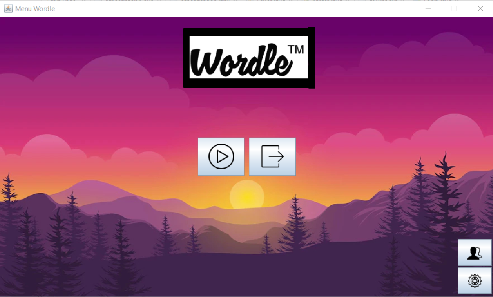

<a id="readme-top"></a>

<!-- PROJECT SHIELDS -->
[![Contributors][contributors-shield]][contributors-url]
[![Forks][forks-shield]][forks-url]
[![Stargazers][stars-shield]][stars-url]
[![Issues][issues-shield]][issues-url]
[![MIT License][license-shield]][license-url]
[![LinkedIn][linkedin-shield]][linkedin-url]

<!-- PROJECT LOGO -->
<br />
<div align="center">
  <a href="https://github.com/vectorete/wordle-game">
    
  </a>

<h3 align="center">Wordle Game</h3>

  <p align="center">
    A Java-based Wordle game implementing a Model-View-Controller (MVC) architecture. This game involves two players: Player 1 who selects the word, and Player 2 who tries to guess the word within a set number of attempts. The game includes a ranking system, a congratulatory or encouragement message at the end of the game, and allows navigation between windows through a menu.
    <br />
    <a href="https://github.com/vectorete/wordle-game"><strong>Explore the docs »</strong></a>
    <br />
    <br />
    <a href="https://github.com/vectorete/wordle-game">View Demo</a>
    ·
    <a href="https://github.com/vectorete/wordle-game/issues/new?labels=bug&template=bug-report---.md">Report Bug</a>
    ·
    <a href="https://github.com/vectorete/wordle-game/issues/new?labels=enhancement&template=feature-request---.md">Request Feature</a>
  </p>
</div>

<!-- TABLE OF CONTENTS -->
<details>
  <summary>Table of Contents</summary>
  <ol>
    <li>
      <a href="#about-the-project">🔎 About The Project</a>
      <ul>
        <li><a href="#features">✨ Features</a></li>
        <li><a href="#built-with">🔨 Built With</a></li>
      </ul>
    </li>
    <li>
      <a href="#getting-started">🚀 Getting Started</a>
      <ul>
        <li><a href="#prerequisites">📝 Prerequisites</a></li>
        <li><a href="#installation">📥 Installation</a></li>
      </ul>
    </li>
    <li>
      <a href="#usage">🧩 Usage</a>
      <ul>
        <li><a href="#game-flow">🌫️ Game Flow</a></li>
        <li><a href="#menu-navigation">☰ Menu Navigation</a></li>
      </ul>
    </li>
    <li><a href="#contributing">🤝 Contributing</a></li>
    <li><a href="#license">©️ License</a></li>
    <li><a href="#contact">☎️ Contact</a></li>
  </ol>
</details>

<!-- ABOUT THE PROJECT -->
## 🔎 About The Project <a id="about-the-project"></a>

<div align="center">
  <a href="https://github.com/vectorete/wordle-game">
    
  </a>
</div>

The Wordle Game follows these main requirements:

- **Player 1 Window**: Allows Player 1 to choose the word length (3 to 5 letters) and the word to be guessed.
- **Player 2 Window**: Displays the word length and allows Player 2 to make guesses. Provides feedback using markers: green for correct letters in the correct position and yellow for correct letters in the wrong position.
- **Attempts**: Player 2 has a maximum of 8 attempts. All attempts are visible at all times, with only the current attempt being editable.
- **End Game**: Saves the number of attempts Player 2 took to guess the word, allowing the creation of a ranking system based on the number of attempts.
- **Images**: Displays a congratulatory or encouragement image at the end of the game.
- **Ranking**: Requests Player 2's name to store in the ranking. The ranking can be viewed from the Player 1 Window and shows the top 10 entries.
- **Navigation**: The application includes a menu for window navigation.
- **Authors**: Displays the authors' names in a window accessible from the menu.
- **Exit Options**: Each window has an explicit option to close it, including the main window, which exits the application.

<p align="right">(<a href="#readme-top">back to top</a>)</p>

### ✨ Features <a id="features"></a>

- **Model-View-Controller (MVC) Architecture**: 
    - **Model**: Stores data for the word chosen by Player 1 and the ranking history.
    - **View**: Defines the various windows of the application.
    - **Controller**: Defines the listeners.

- **Interactive UI**: User-friendly interface for setting up and playing the game.
- **Feedback System**: Visual indicators for Player 2's guesses.
- **Ranking System**: Keeps track of the best attempts and displays the top 10.
- **Menu Navigation**: Easily switch between different windows.
- **Author Information**: Accessible information about the game's authors.

<p align="right">(<a href="#readme-top">back to top</a>)</p>

### 🔨 Built With <a id="built-with"></a>

* [![Java][Java]][Java-url]
* [![Java Swing][Swing]][Java-url]
* [![Netbeans][Netbeans]][Netbeans-url]

<p align="right">(<a href="#readme-top">back to top</a>)</p>

<!-- GETTING STARTED -->
## 🚀 Getting Started <a id="getting-started"></a>

To get a local copy up and running follow these simple steps.

### 📝 Prerequisites <a id="prerequisites"></a>

* Java Development Kit (JDK): Ensure you have JDK 8 or higher installed.
* NetBeans or another preferred Java IDE.

### 📥 Installation <a id="installation"></a>

1. **Clone the repository**:
    ```sh
    git clone https://github.com/yourusername/wordle-game.git
    ```

2. **Open the project in NetBeans**:
    - Open NetBeans and navigate to `File > Open Project`.
    - Select the cloned repository folder.

3. **Build the project**:
    - Right-click on the project in the `Projects` pane and select `Clean and Build`.

4. **Run the project**:
    - Right-click on the project and select `Run`.

<p align="right">(<a href="#readme-top">back to top</a>)</p>

<!-- USAGE EXAMPLES -->
## 🧩 Usage <a id="usage"></a>

### 🌫️ Game Flow <a id="game-flow"></a>

1. **Player 1 Setup**:
    - Player 1 chooses the word length (3 to 5 letters) and enters the word to be guessed.

2. **Player 2 Gameplay**:
    - Player 2 sees the word length and makes guesses. Feedback is provided after each attempt.
    - Player 2 has 8 attempts to guess the word.

3. **End Game**:
    - At the end of the game, the number of attempts is recorded.
    - If Player 2 guesses the word, a congratulatory image is shown; otherwise, an encouragement image is displayed.
    - Player 2's name is requested to store in the ranking.

4. **Viewing the Ranking**:
    - From the Player 1 Window, the ranking can be viewed, showing the top 10 players based on the number of attempts.

<p align="right">(<a href="#readme-top">back to top</a>)</p>

### ☰ Menu Navigation <a id="menu-navigation"></a>

- The menu allows navigation between the main game windows and the ranking window.
- An option to view the authors' information.
- Exit options for all windows to close the application.

<p align="right">(<a href="#readme-top">back to top</a>)</p>

<!-- CONTRIBUTING -->
## 🤝 Contributing <a id="contributing"></a>

Contributions are what make the open source community such an amazing place to learn, inspire, and create. Any contributions you make are **greatly appreciated**.

If you have a suggestion that would make this better, please fork the repo and create a pull request. You can also simply open an issue with the tag "enhancement". Don't forget to give the project a star! Thanks again!

1. Fork the Project
2. Create your Feature Branch (`git checkout -b feature/AmazingFeature`)
3. Commit your Changes (`git commit -m 'Add some AmazingFeature'`)
4. Push to the Branch (`git push origin feature/AmazingFeature`)
5. Open a Pull Request

<p align="right">(<a href="#readme-top">back to top</a>)</p>

<!-- LICENSE -->
## ©️ License <a id="license"></a>

Distributed under the MIT License. See `LICENSE.txt` for more information.

<p align="right">(<a href="#readme-top">back to top</a>)</p>

<!-- CONTACT -->
## ☎️ Contact <a id="contact"></a>

Victor Kravchuk Vorkevych - victorkravchuk19@gmail.com

Project Link: [https://github.com/vectorete/wordle-game](https://github.com/vectorete/wordle-game)

<p align="right">(<a href="#readme-top">back to top</a>)</p>

<!-- MARKDOWN LINKS & IMAGES -->
<!-- https://www.markdownguide.org/basic-syntax/#reference-style-links -->
[contributors-shield]: https://img.shields.io/github/contributors/vectorete/wordle-game.svg?style=for-the-badge
[contributors-url]: https://github.com/vectorete/wordle-game/graphs/contributors
[forks-shield]: https://img.shields.io/github/forks/vectorete/wordle-game.svg?style=for-the-badge
[forks-url]: https://github.com/vectorete/wordle-game/network/members
[stars-shield]: https://img.shields.io/github/stars/vectorete/wordle-game.svg?style=for-the-badge
[stars-url]: https://github.com/vectorete/wordle-game/stargazers
[issues-shield]: https://img.shields.io/github/issues/vectorete/wordle-game.svg?style=for-the-badge
[issues-url]: https://github.com/vectorete/wordle-game/issues
[license-shield]: https://img.shields.io/github/license/vectorete/wordle-game.svg?style=for-the-badge
[license-url]: https://github.com/vectorete/wordle-game/blob/master/LICENSE.txt
[linkedin-shield]: https://img.shields.io/badge/-LinkedIn-black.svg?style=for-the-badge&logo=linkedin&colorB=555
[linkedin-url]: https://linkedin.com/in/vectorete
[product-project]: images/projectimg.png
[Java]:	https://img.shields.io/badge/Java-ED8B00?style=for-the-badge&logo=openjdk&logoColor=white
[Java-url]: https://java.com
[Swing]: https://img.shields.io/badge/Java%20Swing-white?style=for-the-badge&logo=openjdk&logoColor=black
[Swing-url]: https://docs.oracle.com/javase/7/docs/api/javax/swing/package-summary.html
[Netbeans]: https://img.shields.io/badge/NetBeansIDE-1B6AC6.svg?style=for-the-badge&logo=apache-netbeans-ide&logoColor=white
[Netbeans-url]: https://netbeans.apache.org/front/main/index.html
